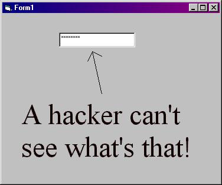

<div align="center">

## Stop hackers\!


</div>

### Description

Do you really hate when you make a textbox for a password, but some hacker comes and turns the *'s into regular words? Well then this is for you. My simple code will stop a hacker from doing that. (Very easy. No API's. Commented)
 
### More Info
 
Before using this code, you should first have a textbox on your form.

Stops hackers


<span>             |<span>
---                |---
**Submitted On**   |
**By**             |[Computer Controller](https://github.com/Planet-Source-Code/PSCIndex/blob/master/ByAuthor/computer-controller.md)
**Level**          |Beginner
**User Rating**    |2.5 (27 globes from 11 users)
**Compatibility**  |VB 4\.0 \(32\-bit\), VB 5\.0, VB 6\.0
**Category**       |[Complete Applications](https://github.com/Planet-Source-Code/PSCIndex/blob/master/ByCategory/complete-applications__1-27.md)
**World**          |[Visual Basic](https://github.com/Planet-Source-Code/PSCIndex/blob/master/ByWorld/visual-basic.md)
**Archive File**   |[](https://github.com/Planet-Source-Code/computer-controller-stop-hackers__1-34181/archive/master.zip)

### API Declarations

```
' No API's
```


### Source Code

```
Dim TimeToEnd As Boolean
Private Sub Form_Load()
Form1.Show
Do ' Loop while form is on
DoEvents
If Text1.PasswordChar <> "*" Then Text1.PasswordChar = "*"
EndIf 'If the password is not in stars, then make it.
Loop Until TimeToEnd
End Sub
Private Sub Form_Unload(Cancel As Integer)
TimeToEnd = True
End Sub
' That's all!
```

